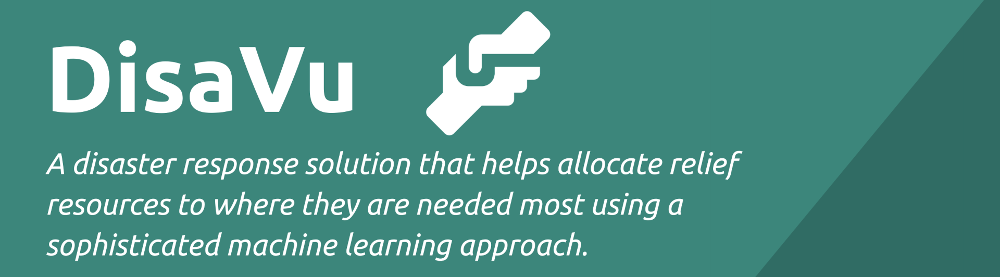
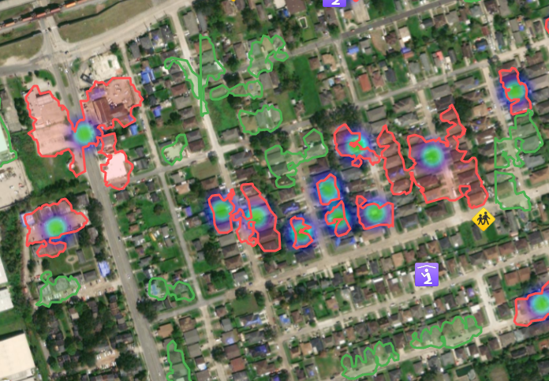
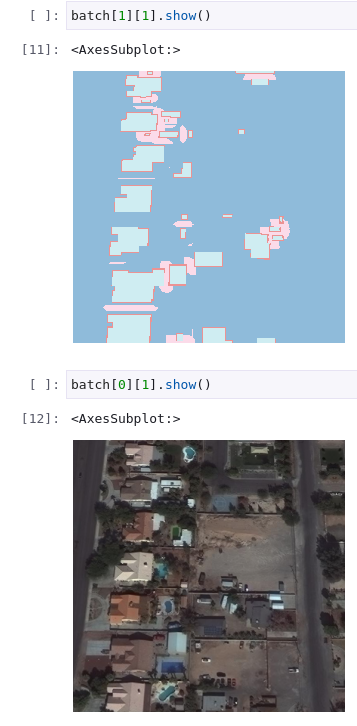
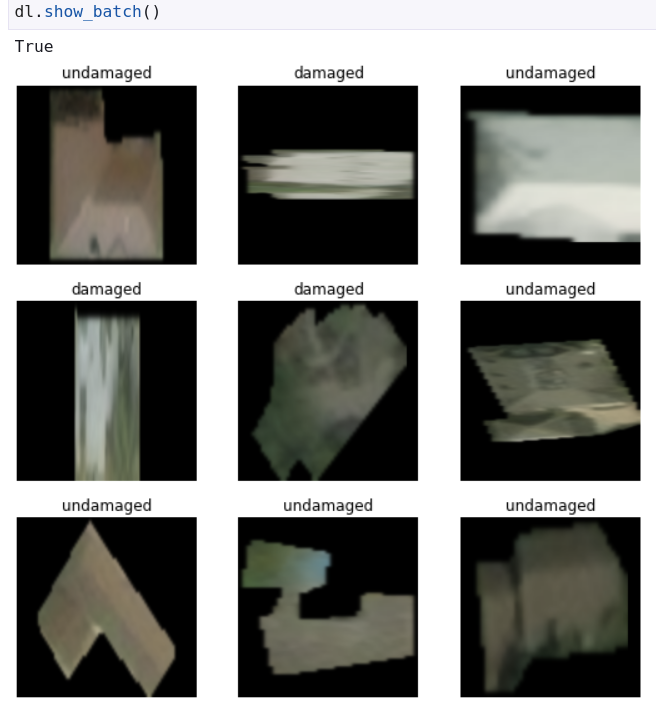
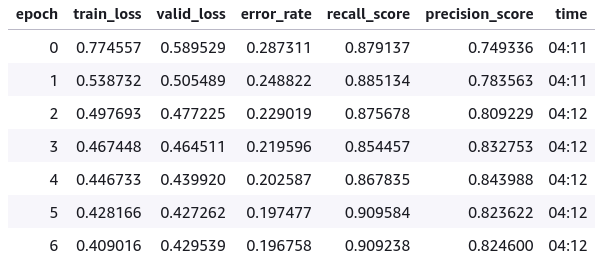
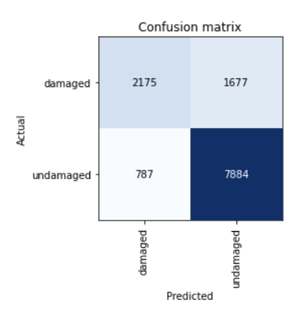
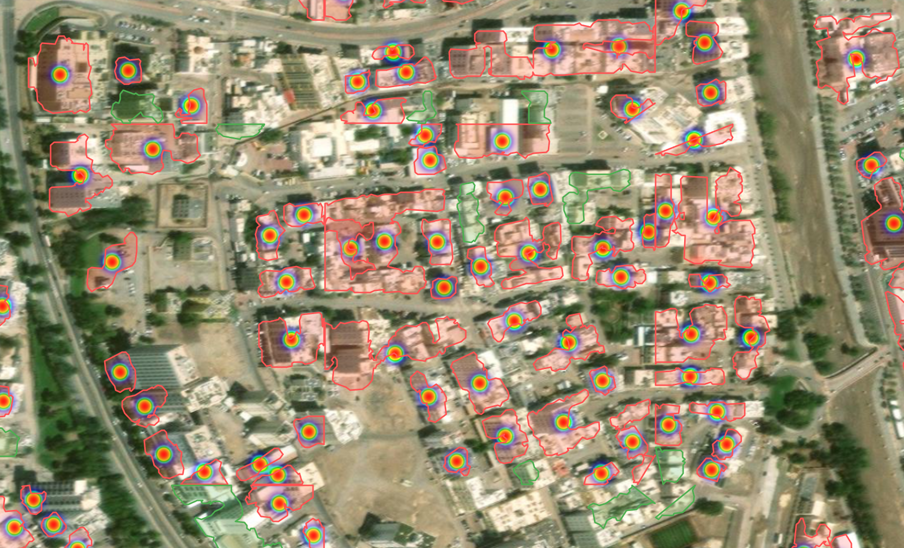

[](https://disavu.silentbyte.com)&nbsp;
[](https://disavu.silentbyte.com)
&nbsp;
[](https://disavu.silentbyte.com)

## Sagemaker Notebooks

To run any of these models you will need to install the correct Conda environment.

You will find the required ml_env_sagemaker file in the ``nbs`` folder. You can run these commands in the Sagemaker
terminal.

```bash
conda env create -n ml_env_sagemaker python=3.8 -f ml_env_sagemaker.yml
conda clean -t 
```

On your notebooks you will then need to select the ml_env_sagemaker kernel.

### Building FootPrint Model

[](https://studiolab.sagemaker.aws/import/github/SrzStephen/DisaVu/blob/main/nbs/stage_1_building_detect.ipynb)

### Building Damage Model

[](https://studiolab.sagemaker.aws/import/github/SrzStephen/DisaVu/blob/main/nbs/stage_2_building_damage.ipynb)

### Inference

[](https://studiolab.sagemaker.aws/import/github/SrzStephen/DisaVu/blob/main/nbs/stage_1_building_detect.ipynb)

# DisaVu Disaster Response System

DisaVu is a disaster response solution that helps direct relief resources to where they are needed most using a
sophisticated machine learning approach. This repository represents our submission for
the [AWS Disaster Response Hackathon Powered By Amazon SageMaker Studio Lab](https://awsdisasterresponse.devpost.com/).

## Inspiration

Natural disasters such as hurricanes, floods, or wildfires, can occur suddenly and have a devastating effect on the
affected communities. Due to environmental changes induced by climate change, it is possible that the frequency of
disasters may increase. It is thus of vital importance that communities are well prepared and that disaster response
teams are optimally equipped with tools that make the allocation of limited resources as efficient and effective as
possible.

*Essentially, DisaVu is a disaster response solution that helps allocate relief resources to where they are needed most
using a sophisticated machine learning approach that is able to detect the extent of damage caused by natural disasters
based on satellite images.*

Furthermore, three challenges from
the [inspiration page on Devpost](https://awsdisasterresponse.devpost.com/details/inspiration) steered us into a more
specific direction:

1. SPB: How might we determine the extent of damage to individual homes in a given disaster-impacted area?

2. ADB: How might we determine the condition of critical infrastructure and prioritize recovery needs after a disaster
   impacts a given area?

3. NASA ESDS: How can we help society respond to natural disasters using Earth Remote Sensing Observations?

## What it does

### The General Concept

Before getting into the technical details, here is a summary of the inference stages:

1. Get a GeoTiff of before and after the natural disaster.

2. Feed the before image into the first model to generate building footprint longitude/latitude polygons.

3. Cut out only those polygons from the after natural disaster image to figure out if they are damaged or not.

4. Show those results on a map to help establish where has been impacted and where has been impacted the most.



## How we built it

### Models

The models were trained in [Amazon Sagemaker Studio Lab](https://studiolab.sagemaker.aws/). Library wise, we
used [FastAI](https://docs.fast.ai/) which builds on top of [Pytorch](https://pytorch.org/) to provide some easy to use high level APIs for
doing machine learning.


A lot of the data manipulation was done with the help of [Solaris](https://github.com/CosmiQ/solaris), [GDAL](https://gdal.org/) and [Shapely](https://pypi.org/project/Shapely/).

#### Model 1: Building detection and masking from satellite imagery

For building detection and masking, we used UNet architecture
using [FastAIs dynamic UNet builder](https://docs.fast.ai/vision.models.unet.html) to perform the semantic segmentation
to go from a satellite image of a house to a mask of the buildings.

The loss function we chose is a combination of [Focal loss](https://arxiv.org/pdf/1708.02002.pdf)
and [Dice loss](https://pubmed.ncbi.nlm.nih.gov/34104926/)
which [seems to perform well when there is a high input and output balance in segmentation tasks](https://arxiv.org/pdf/1805.02798.pdf).

#### Training Data

For training data we used data generated as part of
the [SpaceNet2 Challenge](https://spacenet.ai/spacenet-buildings-dataset-v2),which provides labeled data for 151k
buildings in Las Vegas, 23k in Paris, 92K in Shanghai and 35K in Khartoum.

This data can be downloaded from the Registry of Open Data on AWS. It's worth pointing out that there is both a public
test set and a public train set, we elected only to use the train set and held back a percentage of the tiles for
validation purposes.

```bash
aws s3 cp s3://spacenet-dataset/AOIs/AOI_2_Vegas/misc/AOI_2_Vegas_Train.tar.gz .
aws s3 cp s3://spacenet-dataset/AOIs/AOI_2_Vegas/misc/AOI_2_Vegas_Test_public.tar.gz
```

This dataset is licensed under [CC BY-SA 4.0](https://creativecommons.org/licenses/by-sa/4.0/).

##### Data Prep

We used an open source Python package called [Solaris](https://solaris.readthedocs.io/en/latest/index.html) to prepare
our training data by generating three different masks for the data targets, contact points between buildings, edges of
buildings and interior of buildings.

This approach seems to have been successful by
the [winners of the SpaceNet2 Challenge](https://github.com/SpaceNetChallenge/BuildingDetectors_Round2), we found
without this step the bounds between buildings became very difficult to detect, causing it to try to lump buildings 
together.



For the sake of ease of use, you will find the stage_1 data generator in the data_gen folder at the root of this
directory, which is used to generate the dataset that we use.

##### Results

 #TODO TENSORBOARD

### Model 2: Damage Detection

#### Training Data

We use the [XView2 dataset](https://xview2.org/dataset) which is described at [arxiv](https://arxiv.org/abs/1911.09296).

We are intentionally not providing a direct link top the download of the unprocessed dataset as the owners of this
dataset have requested that people visit their page and sign their Terms and Conditions before downloading.

This data is available under a [CC BY-NC-SA 4.0](https://creativecommons.org/licenses/by-nc-sa/4.0/) license.

This dataset was generated from before and after images provided as part of
the [Maxar Open Data Program](https://www.digitalglobe.com/ecosystem/open-data), showing that releasing this data
can provide pretty useful benefits.

For our purposes we only focused on Hurricanes, Monsoons, and Tornados.

This leads to us having data from the following natural disasters in our training set.
* Hurricane Michael Oct 7-16, 2018
* Hurricane Florence Sep 10-19, 2018
* Hurricane Harvey Aug 17 - Sep 2, 2017
* Hurricane Matthew Sep 28 - Oct 10, 2016
* Monsoon in Nepal, India, Bangladesh Jul - Sep, 2017
* Moore, OK Tornado May 20, 2013
* Tuscaloosa, AL Tornado Apr 27, 2011
* Joplin, MO Tornado May 22, 2011

#### Data Prep

For our data prep we wanted to mask out each building individually so that we could then train a single classifier.

When we began training our model, we noticed we got pretty bad results initially so changed a few more things which are
reflected in the provided Jupyter notebooks:

1. We ignore buildings that are smaller than 25*25 total pixels
2. We discard unclassified data and minor-damaged data.
3. We use a binary no-damage, damage label instead of trying to segment it out further.
   

#### Results

The model was able to get a reasonably high recall and precision with very few epochs.





#### Inference

The inference pipeline looks complicated but can essentially boil down to:

1. Download before and after GeoTiffs
2. Process them with preprocess.py in ```data_gen``` - This script will create a set of fixed sized tiles.
3. Load in the models from the building footprint
   model [](https://studiolab.sagemaker.aws/import/github/SrzStephen/DisaVu/blob/main/nbs/stage_1_building_detect.ipynb)
   and the building damage
   model [](https://studiolab.sagemaker.aws/import/github/SrzStephen/DisaVu/blob/main/nbs/stage_2_building_damage.ipynb)
4. For each image in the ```before``` image, generate a mask of building footprints.
5. Treat this mask as a series of polygons, iterate over every polygon in the image, treat it as the area of interest in
   the after image, and feed it to the building damage model.
6. Map the polygon back into [EPSG:4326](https://spatialreference.org/ref/epsg/wgs-84/) lat lon pairs.

The output of these lat lon pairs is then fed into the frontend to generate the building polygons. These polygons are
then served by the geoserv rust package, generating heatmaps on the fly based on the users view window.

###### Example of this output

```json
{
  "type": "FeatureCollection",
  "features": [
    {
      "id": "0",
      "type": "Feature",
      "properties": {},
      "geometry": {
        "type": "Polygon",
        "coordinates": [
          [
            [
              -90.0261558769928,
              29.959250591177433
            ],
            [
              -90.02622274158406,
              29.959272879374517
            ],
            [
              -90.0261558769928,
              29.959250591177433
            ]
          ]
        ]
      },
      "bbox": [
        -90.02635642706421,
        29.959250591177433,
        -90.02601104741412,
        29.95960711492607
      ]
    }
  ]
}
```

## Components

### XView2 Feature Extractor

The purpose of XView2 Feature Extractor is to extract the required features from the XView2 Data Set. Essentially, the
program takes labels (polygon data) and satellite images as input and then extracts and preprocesses image data for each
label (polygon) and stores the results in output images. Those output images are then subsequently for training the
machine learning part of the DisaVu system.

This was required because we found when trying to iterate over this in python, even using threading, it was running far
too slowly.

XView2 Feature Extractor has been built using: [Rust](https://www.rust-lang.org).

[More details are available here.](./xview2_feature_extractor/README.md)

### GeoServ

GeoServ is a custom-built solution to serve GeoJSON and heatmap data for use in DisaVu. It supports high-performance
geospatial queries using a specific type of [K-d tree](https://en.wikipedia.org/wiki/K-d_tree) to build an index that is
optimized for static data. It used used for visualizations in the front-end and is able to serve polygon and point
GeoJSON data, as well as generate heatmaps for them.

GeoServ has been built using: [Rust](https://www.rust-lang.org), [Actix Web](https://actix.rs).

[More details are available here.](./geoserv/README.md)

### Web App / Map

The web app is the front-end that is intended to be used by a disaster response team to coordinate actions and allocate
resources. The main feature of the app is a dynamic map that visualizes disaster zones by...

- ...showing before/after satellite images,
- ...highlighting buildings/structures outlines (polygons),
- ...giving an indication if structures have been damaged,
- ...rendering a heatmap to show where damage clusters are,
- ...showing relevant amenities such as schools, universities, hospitals, fire stations, police stations, and more.

The app has been built using: [TypeScript](https://www.typescriptlang.org), [VueJs](https://vuejs.org)
, [Leaflet](https://leafletjs.com).

[More details are available here.](./app/README.md)


### Notebooks

Three notebooks which are used to generate each of the stages of the model and run inference.


### Data Prep
A set of data prep scripts for each stage. 


## Challenges we ran into

### The hilariously bad OMAN building damage predictions.

We found that Omans building predictions were fantastic, damage... not so much.



We have two suspicions for why this is the case
1. The after images are a bit blurry, which we think is leading the model to assume that the building is very damaged
2. The images in the after dataset are significantly off axis compared to the before images. This is causing it to look
at the wrong part of the image.

We imagine that this is why the winners of the [xview2 challenge](https://github.com/DIUx-xView/xView2_first_place) chose instead to use a siamese network 
instead of the approach that we took.


### Do I look like I know what JPG compression is

We had a problem where pytorch seemed to disagree with the number of labels in our mask before we realized the cause:
JPG compression introduced artifacts, these artifacts as different values to the 0,1,2,3 classes that our model was
expecting were being interpreted as new classes. The solution? Save your masks as ```.PNG```.

### Conda

We'd never used conda before so had some difficulty setting it up properly, in particular getting all of the
dependencies to resolve nicely. Once we were able to set that up, we realized that it's very useful for reducing issues
of installing libraries like Cuda, CudaNN and GDAL which normally need libraries installed on your computer which are
managed outside of python.

### Geo projections

We spent a LOT of time trying to get our Geo Projections (Going from one coordinate system to another) working properly.

### Clouds

One issue when working with real data is sometimes it isn't what you'd expect. When trying the before/after images, we
came up against issues with clouds that would obscure the features we were looking to analyze, and often these clouds
would be interpreted as buildings.

I think in future we should include some cloud images in the training set so that the building detection and damage
detection models are capable of dealing with them, because right now its behavior seems to be almost random when it
encounters a cloud.

### Man-made post disaster features

One thing that kept cropping up was the roofs with solar panels were occasionally incorrectly getting flagged as being
damaged. We eventually worked out that in a lot of post disaster imagery, people had put blue tarpaulins over damaged
sections of roofs, and if you look at post disaster imagery this becomes apparent very quickly.

### Notebook Complexity

We ended up splitting our code out into separate data processing scripts (partly due to Sagemaker Studios storage
limitations), and separate notebooks for building detection, building damage classification and the final inference
joining the two models together, because we found that if we didn't do this, the notebook got too complicated to follow.

## Sagemaker Suggestions

### Mount Trash in a non-persistent directory

We came up against a weird issue we ran out of space fast!
It turned out that the Trash directory is mounted in
```studio-lab-user@default:~$ pwd /home/studio-lab-user/local/share/Trash/``` AKA the persistent mount.

This means if you're constantly deleting files, it's very easy to fill up all of your persistent 25GB of storage.

We would suggest looking at getting this moved to ``/tmp`` which appears to be on a separate mount that deletes when the
sagemaker studio session restarts.

### Make it more clear about the directory structure

We were initially trying to frantically trying to reduce the size of our datasets before realizing that the file
structure of Sagemaker Studio meant that there was a non-persistent between session directory, which could be accessed
by ```/tmp/```. We believe the docs could be clearer in calling this out as a place to temporarily store files while
training.

```
(studiolab) studio-lab-user@default:~$ df -h
Filesystem      Size  Used Avail Use% Mounted on
overlay          27G  797M   27G   3% /
tmpfs            64M     0   64M   0% /dev
tmpfs           7.7G     0  7.7G   0% /sys/fs/cgroup
shm             4.0G  104M  3.9G   3% /dev/shm
/dev/nvme0n1p1   50G   17G   34G  33% /usr/bin/nvidia-smi
/dev/nvme2n1     25G   13G   13G  49% /home/studio-lab-user
devtmpfs        7.7G     0  7.7G   0% /dev/tty
tmpfs           7.7G   12K  7.7G   1% /proc/driver/nvidia
tmpfs           7.7G     0  7.7G   0% /proc/acpi
tmpfs           7.7G     0  7.7G   0% /sys/firmware
```

## Accomplishments that we're proud of / What we learnt

Getting all of the pieces working together.


In particular we're proud at improving our understanding of Geo Data since for both of us it seems to come up a lot in
work and private projects.

## What we learned

- We had the chance to look into how massive amounts of geospatial data can and should be stored, processed, and queried.
- TODO.

## What's next for DisaVu

Try training the building model on more diverse datasets as its performance seems to be pretty bad in non heavily built
up areas.

Try a different model network for detecting damage as the current strategy has very obvious limitations

Try seeing if it's possible to hook this up automatically on the [AWS SNS topic that sentinel 2 publishes new flyovers 
on](https://registry.opendata.aws/sentinel-2-l2a-cogs/) for automated ingestion of data in known areas of interest.


## Installation

* [Running UI Server]()

