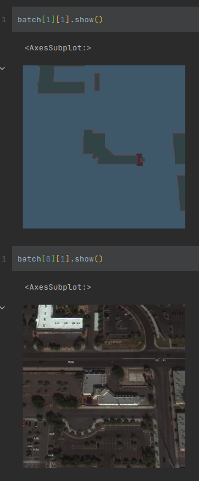
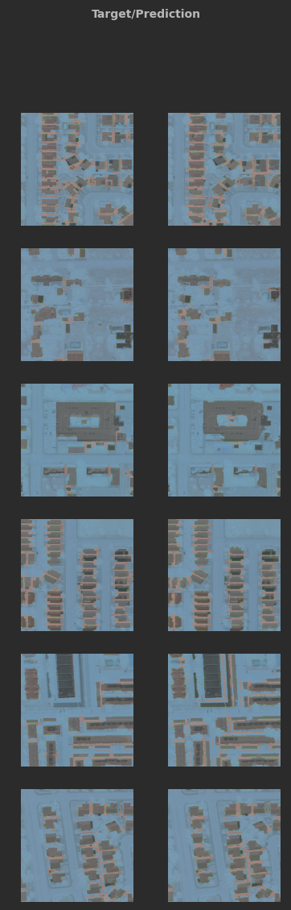
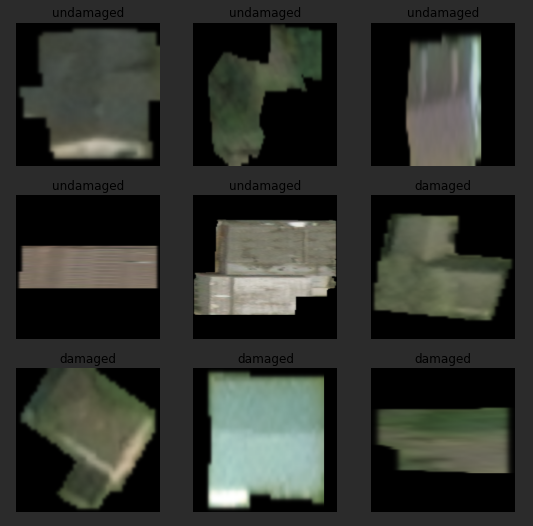

# Home of the ML models for the AWS Disaster Response Hackathon

## What is it


## Inspiration
Realistically this solution was a culmination of 3 challenges on the devpost 
[inspiration](https://awsdisasterresponse.devpost.com/details/inspiration) page, namely:
* SPB: How might we determine the extent of damage to individual homes in a given disaster-impacted area
* ADB: How might we determine the condition of critical infrastructure and prioritise recovery needs after a disaster impacts a given area
* NASA ESDS: How can we help society respond to natural disasters using Earth Remote Sensing Observations.


## The general concept
Before getting into the technical details of this, here's the general gist of the inference stages of this:

Get a GEOTIFF of before and after the natural disaster.

Feed the before image into the first model to generate building footproint longitude/latitude polygons.

Cut out only those polygons from the after natural disaster image to figure out if they are damaged or not.

Show those results on a map to help establish where has been impacted and where has been impacted the most.

**RICO IMAGE HERE**

## Models
Models can be trained using the notebook in a 


### Model 1: Building detection and masking from satellite imagery.
For building detection and masking, we used UNet architecture using[FastAIs dynamic UNet builder](https://docs.fast.ai/vision.models.unet.html) 
to perform the semantic segmentation to go from a satellite image of a house, to a mask of the buildings.

The loss function we chose is a combination of [Focal loss](https://arxiv.org/pdf/1708.02002.pdf) and [Dice loss](https://pubmed.ncbi.nlm.nih.gov/34104926/) which [seems to perform well when there is a 
high input and output balance in segmentation tasks](https://arxiv.org/pdf/1805.02798.pdf).


#### Training Data
For training data we used data generated as part of the [SpaceNet2 Challenge](https://spacenet.ai/spacenet-buildings-dataset-v2).
which provides labelled data for 151k buildings in Las Vegas, 23k in Paris, 92K in Shanghai and 35K in Khartoum.

This data can be downloaded from the Registry of Open Data on AWS. It's worth pointing out that there is both a public
test set and a public train set, we elected only to use the train set and held back a percentage of the tiles for validation
purposes.
```zsh
aws s3 cp s3://spacenet-dataset/AOIs/AOI_2_Vegas/misc/AOI_2_Vegas_Train.tar.gz .
aws s3 cp s3://spacenet-dataset/AOIs/AOI_2_Vegas/misc/AOI_2_Vegas_Test_public.tar.gz
```

This dataset is licenced under [CC BY-SA 4.0](https://creativecommons.org/licenses/by-sa/4.0/)


#### Data Prep
We used an open source Python package called [Solaris](https://solaris.readthedocs.io/en/latest/index.html) to prepare our training data by
generating three different masks for the data targets, contact points between buildings, edges of buildings and interior of buildings.

This approach seems to have been successful by the [winners of the SpaceNet2 Challenge](https://github.com/SpaceNetChallenge/BuildingDetectors_Round2)
and we found without this step, the bounds between buildings became very difficult to train on.



#### Results


Probably worth doing a few things for this section:
1. Include Tensorboard output of training process because that's always neat
2. focus on one good and one bad image from the set
3. Include a foreground_acc metric (non background accuracy) so we have something
4. Make sure to show valid vs train loss (assuming tensorboard)

### Model 2: Damage Detection

#### Training Data
We use the [XView2 dataset](https://xview2.org/dataset) which is described on [arxiv](https://arxiv.org/abs/1911.09296).

This data is available under a [CC BY-NC-SA 4.0](https://creativecommons.org/licenses/by-nc-sa/4.0/) licence.

This dataset was generated from [Maxar Open Data Program](https://www.digitalglobe.com/ecosystem/open-data).

For our purposes we only focused on Hurricanes, Monsoons, Tornado's. which means we have data from
** TODO: Check Monsoon, Get Countries
* Hurricane Michael Oct 7-16, 2018
* Hurricane Florence Sep 10-19, 2018
* Hurricane Harvey Aug 17 - Sep 2, 2017
* Hurricane Matthew Sep 28 - Oct 10, 2016
* Monsoon in Nepal, India, Bangladesh Jul - Sep, 2017 
* Moore, OK Tornado May 20, 2013
* Tuscaloosa, AL Tornado Apr 27, 2011 
* Joplin, MO Tornado May 22, 2011 


#### Data Prep
Take the image, segment it out to only contain that building.



#### Results
Recall, precision, accuracy tensorboard

Show on map


## Inference
Because the point of ML projects is to be useful with the real world, rather than perfectly curated ideal datasets,
the inference stage uses Pr and Post disaster GeoTIFFs from [Maxars Open Data Program](https://registry.opendata.aws/digital-globe-open-data/).

It would be possible to use alternate sources like [Sentinel-2](https://registry.opendata.aws/sentinel-2/) flyovers, but
the Maxxar dataset has the advantage of being very clear about which area and which dates are pre/post disaster.


Two GeoTIFFs are trimmed into areas of interest where they both intersect, and smaller tiles of images are generated
(You'd quickly run out of ram trying to run a ML model against a single 1GB+ GeoTIFF), building footprints are identified
by the first model, then those footprints are cut out from the second image, rated for damaged or not damaged, and then
the resulting polygons are saved as a JSON object in the form of.
### Note to stephen, now geojson format so that it'll work with tile server
```json
{
  "TODO:"TODO""
}
```
This is then used by the frontend


## Additional

This could further be augmented by data from the [Open AI Tanzania Building Footprint Segmentation Challenge Dataset](https://competitions.codalab.org/competitions/20100#learn_the_details)
to include another geographic region, but we avoided doing this to reduce the complexity of the notebook.

The datset we use for building damage detection has more cases than just hurricanes

The dataset we use for building detection has levels of damage 


We've found [This repo](https://github.com/robmarkcole/satellite-image-deep-learning) to be a good source of data sources and ideas.


https://aws.amazon.com/blogs/machine-learning/building-training-and-deploying-fastai-models-with-amazon-sagemaker/


https://docs.aws.amazon.com/sagemaker/latest/dg/studio-lab-use-manage.html
https://docs.aws.amazon.com/sagemaker/latest/dg/studio-lab-use-external.html#studio-lab-use-external-add-button

## Learning

* JPG compressions on masks are... not good.
* Conda, as someone who's more used to pip and pyenv, Conda is great, especially for solving issues of packages needing other dependencies that can be a pain to install like GDAL.


# Limitations
## Data
We stripped down the data used for this for two reasons
1. To reduce sizes 
2. Because while it is posible to use the full 100GB datasets, it's not possible to do this with the 15GB limit on sagemaker studio,
for this sort of thing you'd want the full blown sagemaker.

## Notebook Complexity
Putting all of the code in one block was extremly painful to read, we ended up breaking some code out into their own modules (preprocessing, postprocessing)

